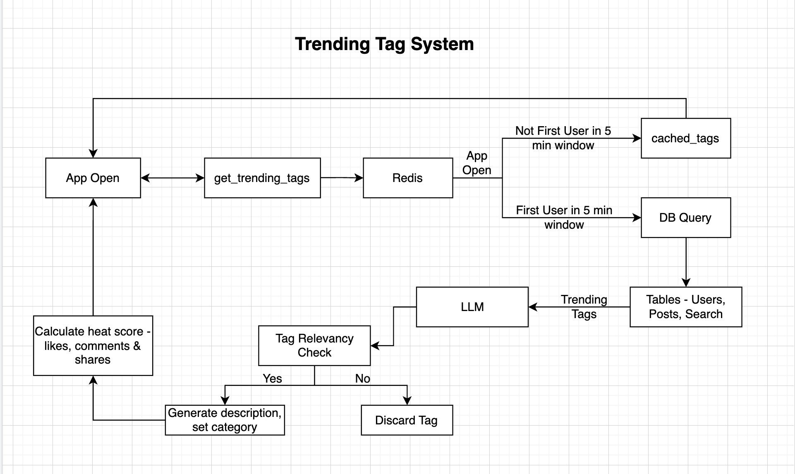

# trending_tag_system
A real-time ranking engine that identifies daily trending topics for Hindi-speaking users using mathematical growth modeling and LLM-based cultural filtering.

Prototype URL - https://daily-trending-tags.lovable.app

1. How the System Decides What’s Trending
The system distinguishes between popularity (high volume) and trending (high growth). A multi-factor scoring engine weighs the following metrics:

    - Velocity (The Spike): Growth rate compared to the 7-day average.
    - User Intent: Active searches for specific tags.
    - Engagement: Depth of interaction (likes, shares, comments) vs. passive views.
    - Demographic Filtering: Data is scoped specifically to Hindi-speaking users.

The 2-Hour "Surge" Logic
The system utilizes a 120-minute sliding window that updates every minute:

    - Current Snapshot: Total usage within the last 2 hours.
    - Baseline Comparison: Compares activity against the 7-day "normal" level.
    - Velocity Check: Flags tags as "Spiking" if current activity significantly exceeds the baseline.
    - Momentum Check: Compares the current 2-hour window against the preceding 2-hour window to verify if the trend is still climbing.
     
2. System Workflow Diagram
      The data follows a circular path to ensure speed and accuracy.
       - The User Opens the App: This triggers the system to check Redis.
       - The Fast Lane: If a list was generated in the last 5 minutes, it is served instantly from the cache.
       - The Heavy Lifting: If the cache is empty, the system pulls data from the Database, runs it through the AI (LLM) for filtering, calculates the final Heat Scores, and updates the cache for the next user.
       
   
4. Stages: Models, APIs, and TechniquesStage
   
    1. Data Aggregation,SQL (CTEs),Fastest way to join millions of rows and filter by language/time windows.
    2. Scoring,Min-Max & Logarithmic,Normalizes scores (0–100) and prevents massive spikes from breaking the scale.
    3. Cultural Filtering,Claude-3-Sonnet,"Filters spam, categorizes tags, and generates natural Hindi descriptions."
    4. Infrastructure,Redis (5m TTL),Ensures cost-efficiency and speed by preventing redundant AI calls.
    5. User Interaction,Argmax Signal Logic,"Assigns labels like ""अत्यधिक खोजा गया"" (Highly Searched) to provide context."
       
5. UX Rationale
The system was redesigned to move from a simple "list of words" to a data-rich experience that eliminates the "black box" nature of trending algorithms.

Key Optimizations
        - Every tag features a driver (e.g., "Highly Searched") so users understand the "why" before clicking.
        - An info icon explains the "Heat Score" in simple Hindi.
        - "Hero Media" (top image/video) provides instant visual understanding of the trend.

Layout Decisions
        - On mobile, a "People Also Viewed" section is injected after the first three posts to maintain discoverability.
        - To avoid clutter, the system shows the Top 5 trends on Desktop and Top 2 on Mobile, with a "View More" option for interested users.

Design Rejections
        - Rejected purely mathematical rankings to ensure the AI filter prioritizes local, Hindi-specific relevance.
        - Rejected real-time calculation per user to prevent server bottlenecks and maintain predictable API costs.
        
6. Next 4 Weeks Plan

        1. Week 1: Multi-Lingual Expansion & Quality Assurance
                  The primary goal is to scale the existing architecture to support the full diversity of the user base while maintaining high content standards.
                - Language Scaling: Expand the multi-factor scoring engine and LLM filtering to include all supported languages within the app.
                - Edge Case Handling: Refine the Claude-3 cultural filter to understand regional nuances beyond the Hindi-speaking demographic.
   
        2. Week 2: Personalized "For You" Tags
                The focus is on transitioning to a Personalization model. This model balances "Global Momentum" with "Individual Relevance" by maintaining two distinct sections within the UI.
                - Interest Mapping: Build a lightweight user profile based on historical interactions (previously viewed, liked, shared, or commented tags and posts).
                - Affinity Scoring: The system will look for tags that are currently "Warm" (growing) and match the user’s high-scoring interest categories.
   
        3. Week 3: Dynamic Feed Injection Algorithm
                - Variable Spacing: Replace the fixed "first 3 posts" logic with a dynamic algorithm that injects trending or curated tags at optimal intervals (e.g., every 5–8 posts).
                - Scroll-Depth Optimization: Adjust injection frequency based on the user's scroll speed and session duration to maximize click-through rates (CTR).
   
        4. Week 4: Analytics, Retention & Optimization
                - Metric Analysis: Deep dive into DAU (Daily Active Users) and WAU (Weekly Active Users) specifically interacting with the trending system.
                - Retention Tracking: Measure how the "Trending" system impacts overall app retention—specifically if users who engage with tags have higher session frequencies.
